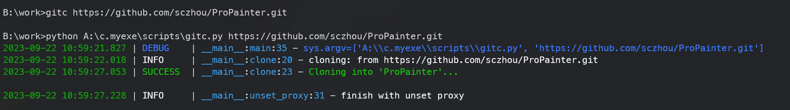

# Git使用本地代理来克隆项目

## 背景

一般我们会遇到github上的项目克隆不下来的问题

有个操作就是配置一下git的代理, 但配置完有时候又会影响到一些普通的git操作

所以这个工具的作用就是: 设置代理 -> 然后执行克隆 -> 取消代理

## 1. 使用

推荐为程序配置环境变量, 这样就可以在任意目录下使用了✔
工具的配置文件在 `~/.gitc/gitc.conf` 可以手动更改 host, port

```shell

在你的工作目录执行

   ```shell
   gitc https://github.com/3181538941/git_proxy.git
   ```

执行效果


更多方式

```shell
gitc -h
```

## 2. 开发

安装依赖

```shell
pip install -r requirements.txt
```

构建

[build.md](./build.md)

## 3. fuck😒

代码推送过程中遇到了比较常见的问题
> fatal: unable to access 'https://github.com/3181538941/git_proxy.git/': OpenSSL SSL_read: Connection was reset, errno 10054

这种情况下就需要设置代理, 我意识到 需要脚本来实现设置代理和取消设置代理

所以添加了两个脚本 `-s`, `-u`

可以快捷地设置和取消设置git proxy

## 4. 原理

1. 执行代理设置命令

    ```shell
    git config --global http.proxy http://127.0.0.1:7890
    git config --global https.proxy http://127.0.0.1:7890
    ```

2. 执行克隆命令

    ```shell
    git clone https://github.com/3181538941/git_proxy.git
    ```

3. 取消设置代理 避免影响git正常使用

    ```shell
    git config --global --unset http.proxy
    git config --global --unset https.proxy
    ```

